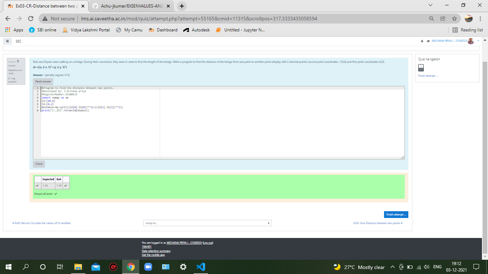

# DISTANCE-BETWEEN-TWO-POINTS

## AIM:
To write a python program to find the distance two 2 points
## ALGORITHM:
### Step 1: Import numpy
### Step 2:Assign the distances. 
### Step 3: solve using sqrt.
Substitute the values in the distance formula  
### Step 4: print output with  2 decimals.
### Step 5: Print the output.
### PROGRAM:
```import numpy as np
l2=[10,6]
l1=[4,2]
distance=np.sqrt(((l2[0]-l1[0])**2)+((l2[1]-l1[1])**2))
print("{:.2f}".format(distance))
```
  


### OUTPUT:



### RESULT:
The distance of two points has been found.
